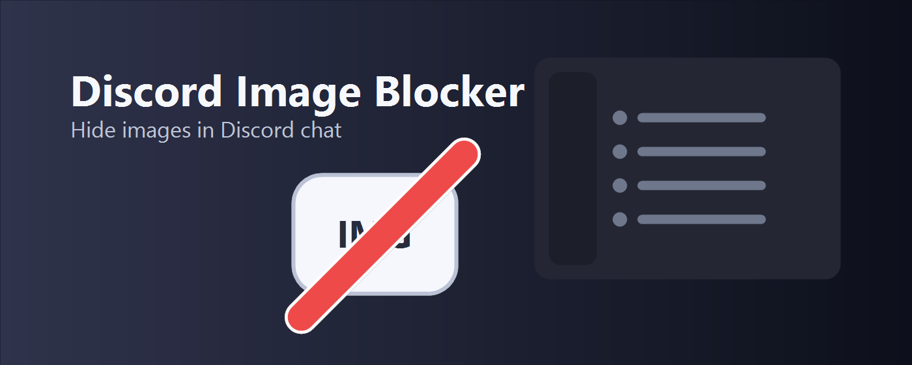

# Discord Image Blocker

[](CHANGELOG.md)
[](LICENSE.txt)
[](#privacy)

A tiny Chrome extension that hides image media on `discord.com`.

## Status

Discord Image Blocker was published on the Chrome Web Store, then removed by an automated Chrome Web Store review for a "Spam and placement" policy issue.

The extension remains open source and can still be installed manually for local use. Separate Chrome Web Store publication is paused to avoid presenting this project as a duplicate of related Discord media-blocking extensions. Future work may consolidate image and GIF blocking into one media-focused extension instead.



## Why

Discord Image Blocker hides image media in Discord chat when you want a calmer view with fewer visual distractions.

The extension has one job, runs only on Discord, and does not collect data.

## Install

For local development or manual install:

1. Download or clone this repository.
2. Open `chrome://extensions`.
3. Enable **Developer mode**.
4. Click **Load unpacked**.
5. Select this extension folder.

## Features

- Hides image media that users send in Discord chat.
- Runs only on `discord.com`.
- Uses Chrome's built-in localization system.
- Does not collect data or send analytics.
- Does not use remote code.

## How It Works

The content script watches Discord's web UI and hides image-related media containers when Discord renders them.

It does not:

- read or store your messages
- modify your Discord account
- send data anywhere
- block Discord's backend directly

It only changes the visible web UI in your browser.

## Project Structure

- `manifest.json` - Chrome extension manifest
- `content.js` - content script that hides image media on Discord
- `_locales/` - localized extension name and description strings
- `assets/icons/` - generated extension icons
- `assets/store/` - generated Chrome Web Store promotional images
- `store-listing/` - Chrome Web Store description copy split by locale
- `STORE_LISTING.md` - Chrome Web Store listing index
- `STORE_JUSTIFICATIONS.md` - single-purpose, host-permission, remote-code, and data-use justifications
- `PRIVACY.md` - privacy policy
- `PROJECT_PHILOSOPHY.md` - product scope and feature decision notes
- `tools/generate-assets.ps1` - reproducible icon and promotional image generator
- `LICENSE.txt` - GPL license text

## Development

After making changes, reload the extension from `chrome://extensions` and refresh Discord.

Regenerate icons and Chrome Web Store promotional images:

```powershell
powershell -NoProfile -ExecutionPolicy Bypass -File tools\generate-assets.ps1
```

Regenerate sanitized Chrome Web Store screenshots:

```powershell
powershell -NoProfile -ExecutionPolicy Bypass -File tools\generate-store-screenshots.ps1
```

Create a Chrome Web Store upload package:

```powershell
powershell -NoProfile -ExecutionPolicy Bypass -File tools\package.ps1
```

## Localization

The extension supports 50 locales through Chrome's `_locales` directory.

Chrome Web Store listing copy is maintained separately in `store-listing/`, with [STORE_LISTING.md](STORE_LISTING.md) as the index.

## Store Review

Chrome Web Store permission and privacy justifications are documented in [STORE_JUSTIFICATIONS.md](STORE_JUSTIFICATIONS.md).

## Project Philosophy

Product scope and feature decisions are documented in [PROJECT_PHILOSOPHY.md](PROJECT_PHILOSOPHY.md).

## Privacy

Discord Image Blocker does not collect, store, or transmit any data. It has no analytics, no tracking, no remote server, and no remote code.

See [PRIVACY.md](PRIVACY.md) for the full privacy policy.

## Support

If this extension saves you time and you want to support its development:

[](https://buymeacoffee.com/molodchyk)
[](https://www.patreon.com/OMolodchyk)

## License

This project is licensed under the GNU General Public License v3.0. See [LICENSE.txt](LICENSE.txt) for details.
